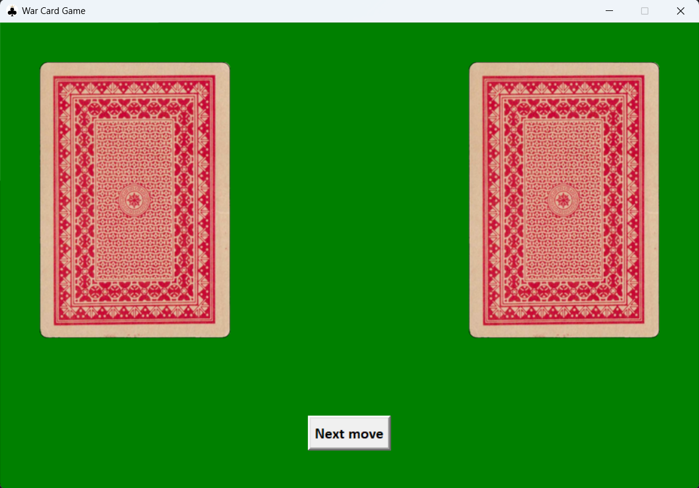
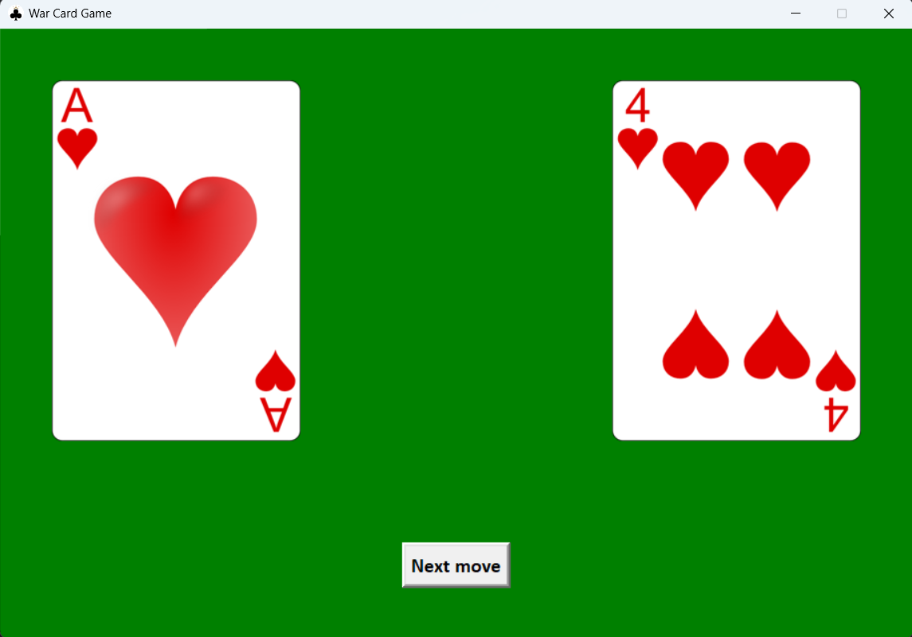
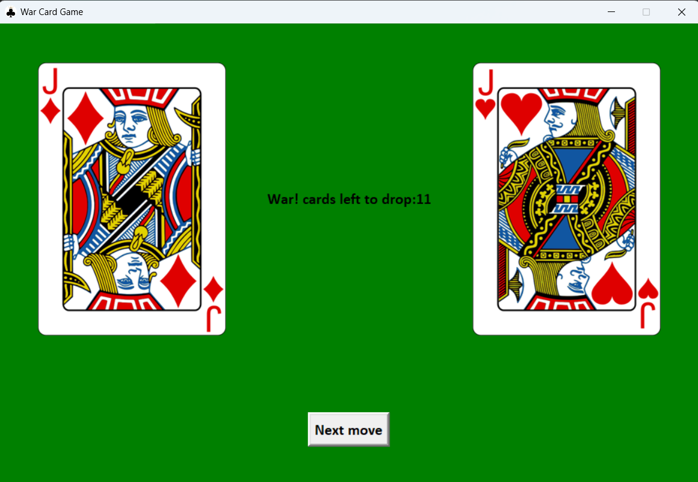
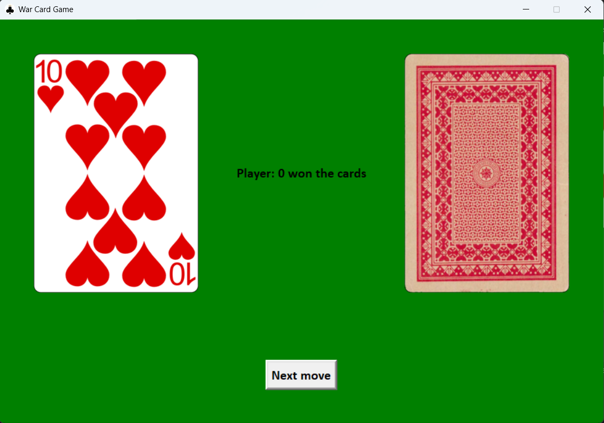
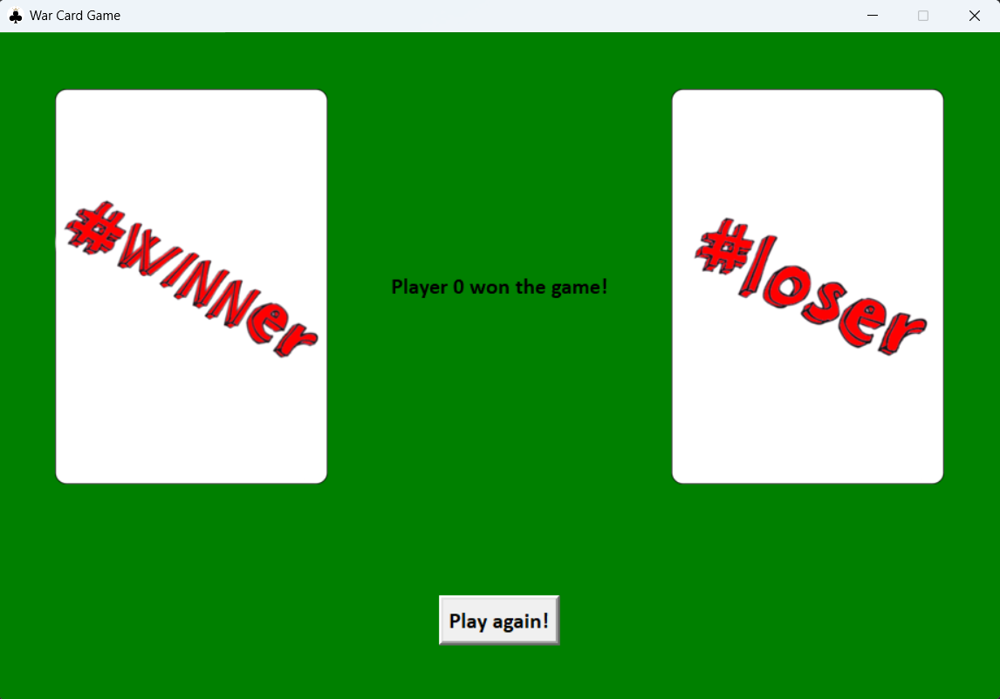

# WarCardsGame

## Overview

**WarCardsGame** is a card game implemented in Python, utilizing a graphical interface built with Tkinter. The objective of the game is to collect as many cards as possible, winning them from your opponent.

## Components

1. **Main.py**: This file contains the main code of the application. It handles the initialization of the graphical interface, game state management, and user interaction.
   
2. **CardsController.py**: This module contains class definitions for managing the cards and the card game. It includes the `Player` class, representing each player, and the `War` class, which manages war situations in the game.

## Game Flow

1. **Game Initialization**: The game begins by initializing the graphical interface and the game state. Each player receives a set of cards.
   
2. **Move Processing**: The player can make a move by pressing the "Next move" button. Depending on the game state, different actions are taken:
   - If it is in the initialization phase, the game prepares to start.
   - If it is in the war phase, the cards and corresponding moves are managed.
   - If it is in the card display phase, the graphical interface is updated with the current cards.

3. **End of Game**: The game ends when one of the players runs out of cardsA corresponding message is displayed, and the option to play again is provided.

## Key Features
- Game initialization with two players.
- Handling moves and game state during war.
- Updating the graphical interface with each player's cards and game state information.
- End of the game and displaying the result.

## User Interface

- *Game started state*
  
 
- *Idle state (a next move can be performed)*
  

- *Players started a war*
  

- *Player won a war*
  

- *Player won*
  

## Resources

- Card images used in this project were downloaded from [Vector Playing Cards](https://code.google.com/archive/p/vector-playing-cards/downloads?).

## Collaborator
- Macsim Oana